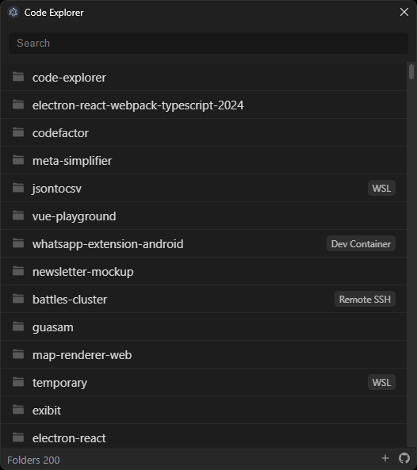

# Code Explorer

Code Explorer is an application that helps you easily explore your recently opened Visual Studio Code projects. It provides a user-friendly interface to quickly access and search your projects, making laziest developers life a bit more relaxing.

<br />

<p align="center">

</p>

<br />

## Installation

To install and run VSCode Projects Explorer locally, follow these steps:

1. Clone the repository:

   ```sh
   git clone https://github.com/guasam/code-explorer
   ```

2. Navigate to the project directory:

   ```sh
   cd code-explorer
   ```

3. Install the dependencies:

   ```sh
   npm install
   ```

4. Start the application:

   ```sh
   npm dev
   ```

<br />

## Usage

Once the application is running, you can:

- **State File Path**: Set the state file path from your vscode installation directory.

```
"C:\Users\{Username}\AppData\Roaming\Code\User\globalStorage\state.vscdb"
```

- **View Recent Projects**: See a list of your recently opened Visual Studio Code projects.
- **Open Projects**: Click on a project name to open it in Visual Studio Code.

<br />

## Production / Distribution

To build the application for production usage on windows platform, use this commnad:

```
npm run build:win
```

<br />

## For Your Information

This application is currently supported for the Windows platform. If you'd like to contribute to this project for other platforms (mac, linux, etc.), all pull requests are welcome.
